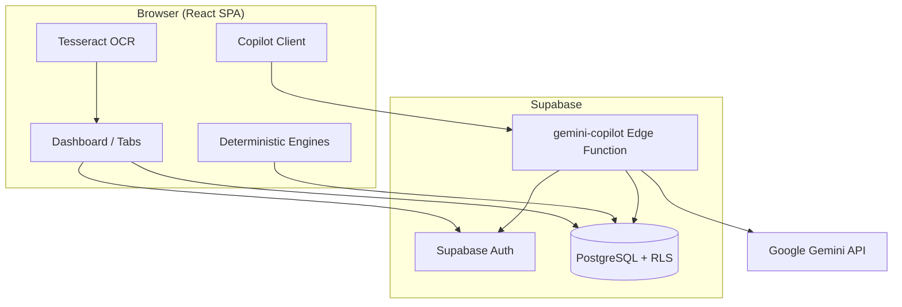
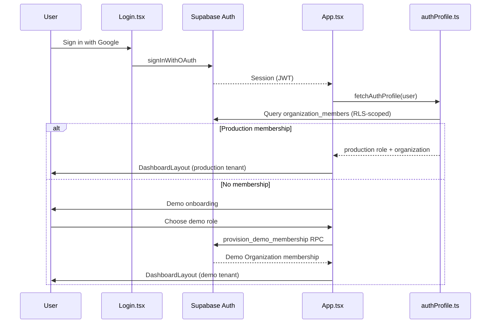
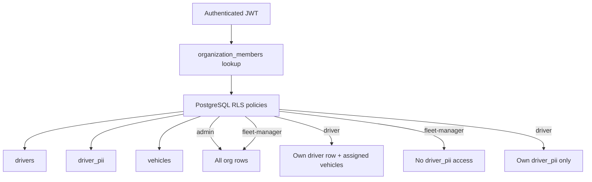
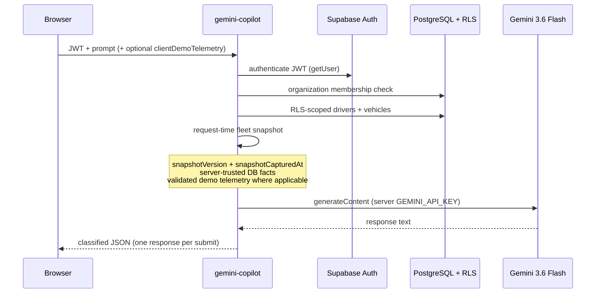
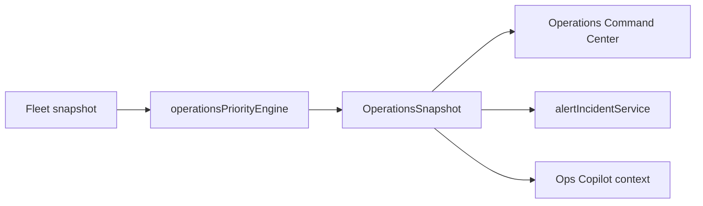
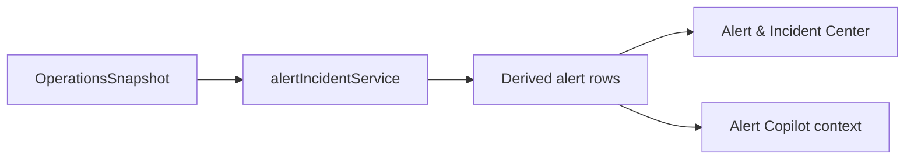
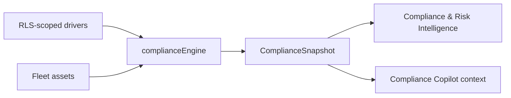
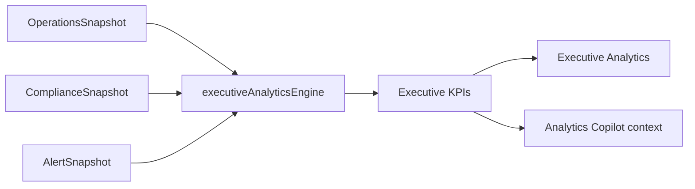
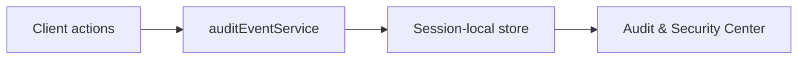
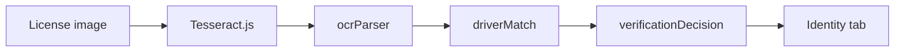

# SovereignShield AI — Architecture

This document describes the system architecture, authentication/authorization flows, and intelligence engine pipelines.

---

## System Architecture



**Principle:** Authorization is enforced at **Supabase Auth → organization_members → RLS**. The frontend may filter for UX, but never replaces RLS as the security boundary.

---

## Authentication Flow



| Step | Detail |
|------|--------|
| Login methods | **Google OAuth** (real). Smart-ID / Mobile-ID are mock-only. |
| Login role selector | Cosmetic on Login screen — **not** used for authorization. |
| Demo onboarding | Authenticated users without membership choose Demo Admin / Demo Fleet Manager / Demo Driver. Applied only to the isolated Demo Organization via backend RPC. |
| Session | Supabase JWT stored by Supabase client; refreshed automatically. |
| Profile | `organization_members.role` → `MembershipRole` (`admin`, `fleet-manager`, `driver`). Production org takes precedence over demo org. |

---

## Demo Access

```
Production:
  Google Auth → production organization membership → real Admin / Fleet Manager / Driver role

Public Demo:
  Google Auth → Demo onboarding → Demo Organization
  → Demo Admin / Demo Fleet Manager / Demo Driver
  → same application experience → synthetic demo data
```

- Demo tenant (`SovereignShield Demo`) is isolated from production (`SovereignShield Fleet`) via `organization_id` + RLS.
- Demo fleet rows, telemetry labels, and `driver_pii` are synthetic fixtures.
- Demo users do not receive production organization access.
- Role selection (onboarding and in-app Demo Role Switch) applies only to the Demo Organization through `provision_demo_membership`.
- Demo onboarding supports many independent authenticated users, subject to normal platform and infrastructure limits.
- Production membership takes precedence if both memberships exist.

---

## RLS Authorization Flow



### Role matrix (SELECT only)

| Table | Admin | Fleet Manager | Driver |
|-------|-------|---------------|--------|
| `drivers` | All org | All org | Own row (`user_id = auth.uid()`) |
| `driver_pii` | All org | **Denied** | Own row only |
| `vehicles` | All org | All org | Assigned via `assigned_driver_id` |
| `organization_members` | Self + staff | Self + staff | Self only |

No INSERT/UPDATE/DELETE policies for clients — read-only application data model. Demo membership is written only by `provision_demo_membership`.

### Frontend supplement (not substitute)

`fleetService.ts` applies `stripDriverPii()` for Fleet Manager and gates PII queries with `mayRequestDriverPii()`. This aligns UI with RLS but **does not replace** database enforcement.

---

## Copilot Flow



```
Browser
  → JWT
  → gemini-copilot Edge Function
  → authentication + organization membership
  → server-trusted RLS-scoped context
  → validated demo telemetry where applicable
  → Gemini 3.6 Flash
  → response
```

The browser does **not** send an authoritative Copilot context body. Fleet facts are loaded server-side under the caller's RLS scope at request time.

### Server-trusted snapshot

| Field | Source | Notes |
|-------|--------|-------|
| `assignments` | RLS-scoped `vehicles` + `drivers.name` | Server-trusted DB fact |
| `licenseExpiry` | RLS-scoped `drivers.name` + `expiry_date` | Server-trusted DB fact; no PII codes |
| `simulatedClearance` | DB `compliance_tier`, optionally overlaid by validated client demo telemetry | Always labeled simulated |
| `telemetryMode` | Always `'simulated'` | Not live GPS |
| `snapshotVersion` | Monotonic server counter for this Edge isolate | Identifies this request-time snapshot |
| `snapshotCapturedAt` | ISO timestamp when the snapshot was built | Request-time capture |
| Engine fields | Derived from the same snapshot | Priorities, health summary, recommended actions |

**Never sent:** `personalCode`, `licenseNumber`, `role`, `organization_id`, raw JWT.

**Body identity fields** (`role`, `organization_id`, `driver_id`, `vehicle_id`) are **ignored** for authorization.

**Client demo telemetry:** optional simulated clearance rows are merged only for asset IDs already visible via RLS. They cannot invent vehicles, change assignments, or override license expiry.

### Timeouts and bounded retry

| Layer | Budget |
|-------|--------|
| Edge overall deadline | 40s (`GEMINI_UPSTREAM_TIMEOUT_MS`) covering all attempts + backoff |
| Gemini attempts | 3 max (`GEMINI_MAX_ATTEMPTS`) = initial + up to 2 transient retries |
| Retry backoff | 500ms → 1000ms exponential, capped at 2s, plus ≤250ms jitter; `Retry-After` honored where applicable |
| Permanent errors | No retry for 400/401/403/404 or timeouts/aborts |
| Client invoke | 46s (`COPILOT_INVOKE_TIMEOUT_MS`); **no client-side retry loop** |

Retries are **internal to one Edge request**: the browser issues exactly one
`functions.invoke()` per user submission and receives either success or a single final
failure. A retry is abandoned when fewer than `GEMINI_MIN_ATTEMPT_BUDGET_MS` (1.5s) of the deadline would remain.

---

## Operations Flow



1. Fleet assets loaded via RLS-scoped `fleetService`.
2. `operationsPriorityEngine` computes deterministic priorities (compliance from license expiry, simulated vehicle telemetry flagged).
3. UI displays priority table with **Simulated** badges where applicable.
4. The UI may attach request-time simulated telemetry. Gemini context is rebuilt server-side from RLS-scoped facts plus validated demo telemetry.

---

## Alert Flow



Alerts are **derived** from operational priorities — not fabricated incident records. Source labeled `simulated-vehicle-telemetry` where applicable.

---

## Compliance Flow



- License expiry parsed deterministically.
- Compliance percentage is `null` + "Unavailable" when no parseable expiry data exists (never misleading 100%).
- Vehicle compliance rows use `source: 'simulated-telemetry'`.
- **No driver risk scores.**

---

## Executive Analytics Flow



Executive KPIs **reuse** deterministic engine outputs — no independent Gemini-generated metrics.

---

## Audit Flow



- Events recorded for auth, Copilot, membership, OCR, etc.
- **Session-local only** — not persisted to database.
- Sensitive fields (PII, tokens, prompts) excluded from serialization.
- Driver role sees filtered subset via `filterAuditEventsForViewer()`.

---

## Identity / OCR Flow (Local)



Browser-only pipeline. Not a government verification boundary. PII from OCR stays in browser memory.

---

## Data Sources

| Source | Label | When |
|--------|-------|------|
| `supabase` | Data Source: Supabase | Successful RLS-scoped query |
| `fallback` | Data Source: Demo Fallback | Empty/error or unconfigured Supabase |

Fallback records are marked `DEMO RECORD` and must not be presented as live production data.
